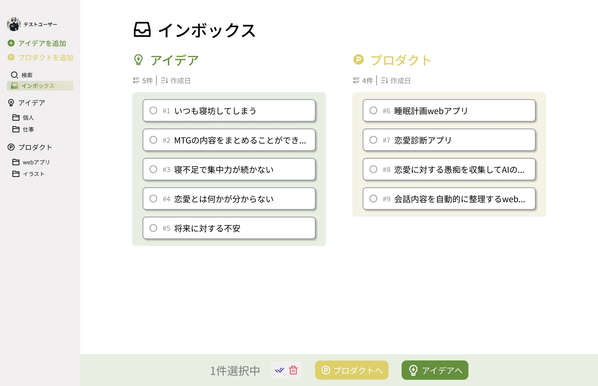
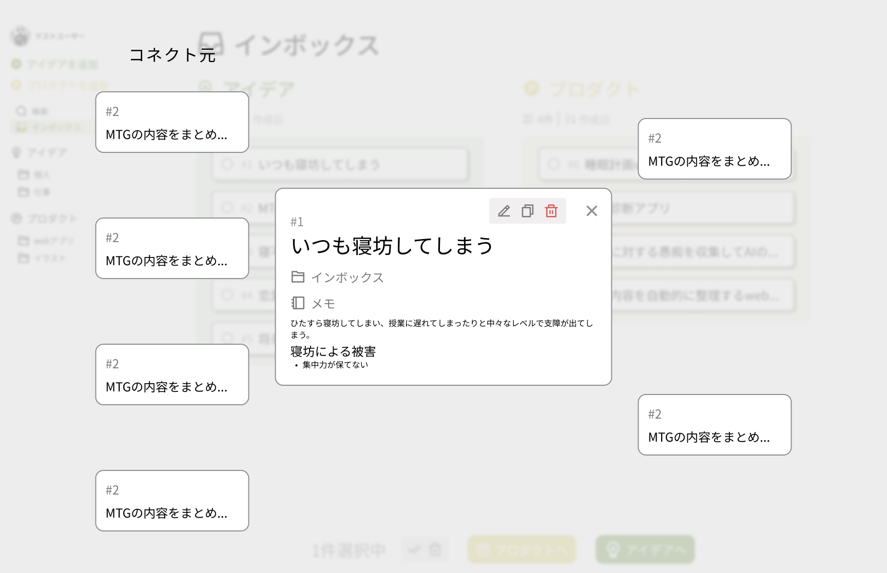
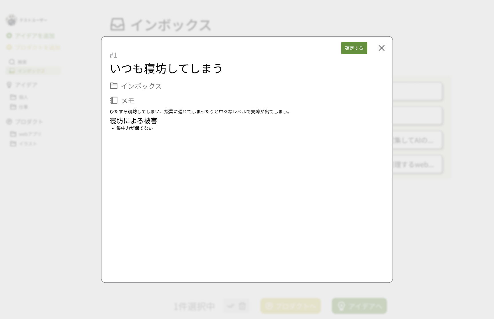

# ideadeck

「身近なアイデアを、プロダクトに」

## What is ideadek?

### 概要

- 「個人開発をしたいけど、中々案が出せない」
- 「イラストを描きたいけど、構想がない」

普段からクリエイティブな活動をしている人は必ずと言ってもいいほど経験するであろうこの悩み。
この悩みは決して初心者だから起きるわけではありません。どんな人でも経験する悩みです。

かくいう私もこのような悩みを経験しており、どうにかしてこの悩みを解消したいと思っていました。
そこで私は、以下のようなアプローチを取ることで、新しいプロダクトを生み出せるのではないかと考えました。

1. 個人開発においては、身近な問題や内容から深掘りすると良い
2. どんな些細なアイデアでもメモするのが良い

そこで私は、このようなアプローチを簡単に取れるためのwebアプリを開発することにしました。

### 名称

**ideadeck**

これは、「idea（アイデア）」と「deck（デッキ）」を組み合わせた造語です。
皆さんの身近なアイデアを集め、デッキに並べることで、プロダクトを作成できるというwebアプリに対する思いを込めました。

## WF

### ダッシュボード

### カード詳細

### カード編集

## 使用している技術

|   項目    |           技術           |            採用理由            |
|:-------:|:----------------------:|:--------------------------:|
|  インフラ   | docker(docker compose) |       複数のコンテナを管理するため       |
| フロントエンド |        Next.js         |      SSRを採用して高速化を図るため      |
| バックエンド  |           Go           |      全体的にパフォーマンスが高いため      |
| データベース  |         redis          |        session管理に採用        |
| データベース  |         MySQL          |         データの永続化に採用         |
|  SMTP   |        mailhog         |        メール送信のテストに使用        |
|   その他   |      クリーンアーキテクチャ       | 外部インフラとの依存を減らし、ドメインを保護するため |
